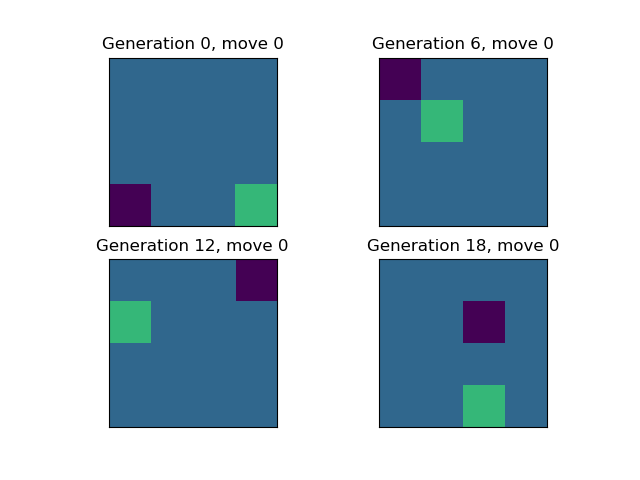
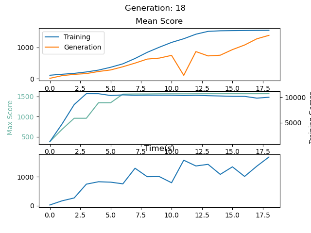
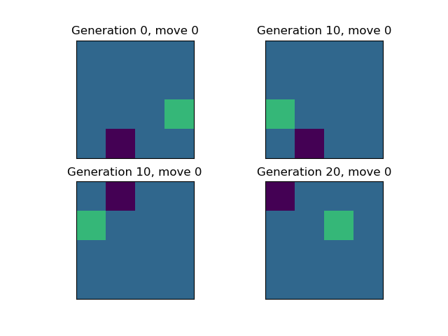
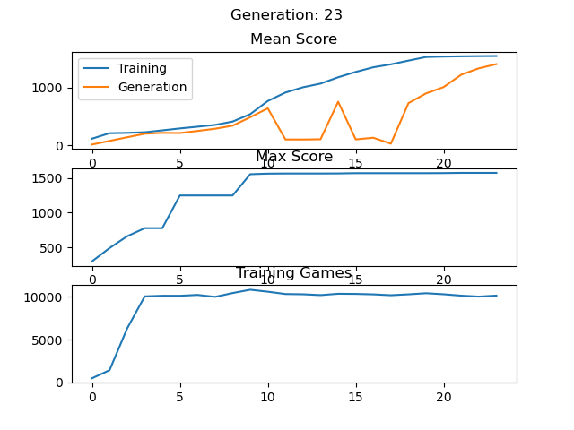
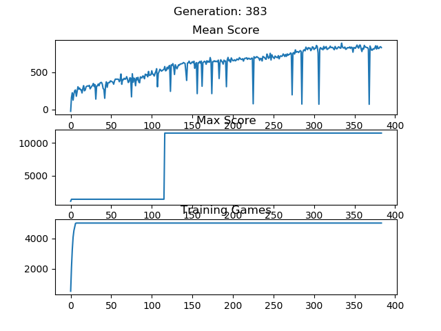
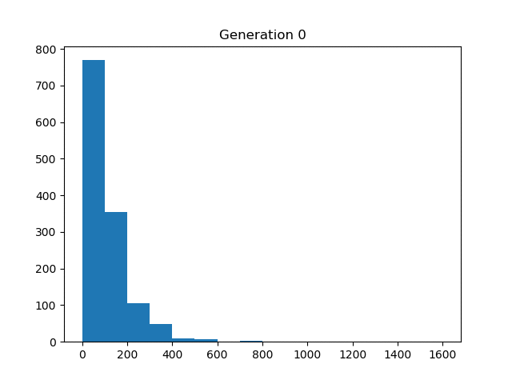
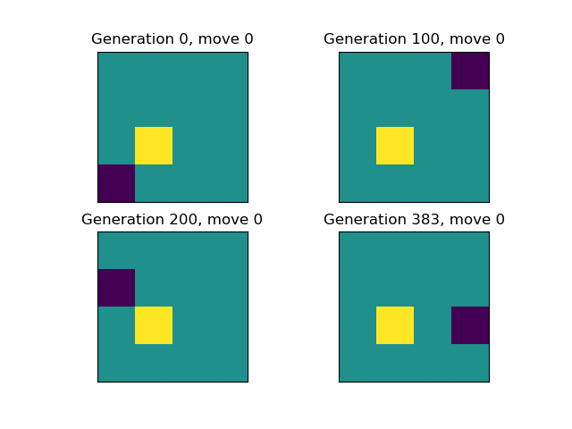

## Snake reinforcement learning.
Trains a neural net to play the arcade game snake using reinforcement learning.
### Revamped method
Neural network and training was overhauled as well as playing many more games per generation made possible via numpy acceleration of snake game playing. A percentage of moves are also taken randomly while training.

#### Decreasing exploration rate
  
Examples of neural net perforamnce at each generation. Notice that at earlier generations the snake can get stuck in loops that while safe, will result in a timeout.  
  
Performance as a function of generation with a exploration rate of 20% that decreases to 5% over time. Notice that the training does not converge at generation 11!  
#### Constant exploration rate
  
Examples of neural net perforamnce at each generation.  
  
Performance as a function of generation with a constant exploration rate of 10% while the score is below 1000. Notice the training does not converge for several generations between 10 and 20.
 
### Old Method
This snake reinforcement learning performs the following steps:
1. Play ~500 games using the most recent neural network.
2. Take the best games from this generation and add them to the training dataset.
3. Remove the worst games from the training dataset.
4. Train a new neural network using the updated training dataset.

Below are the results of my ~3day training session.  
  

Top subplot shows the mean score of all games in that generations training set before any games are filtered out.  
Middle subplot shows the maximum score achieved in the training set. Scoring is +100 for food, -1 for move, +10000 for victory.  
Bottom subplot is number of games in the training set.  
  
  
  
The score histogram of each training generation.  
  
  
  
A sample game using the neural network from different generations of training.  