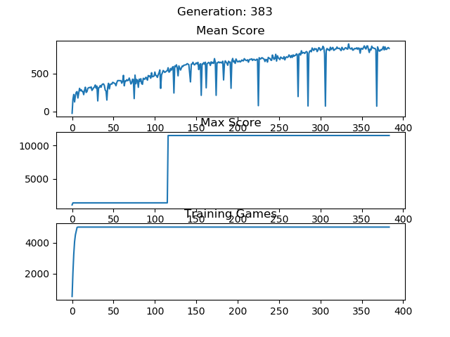
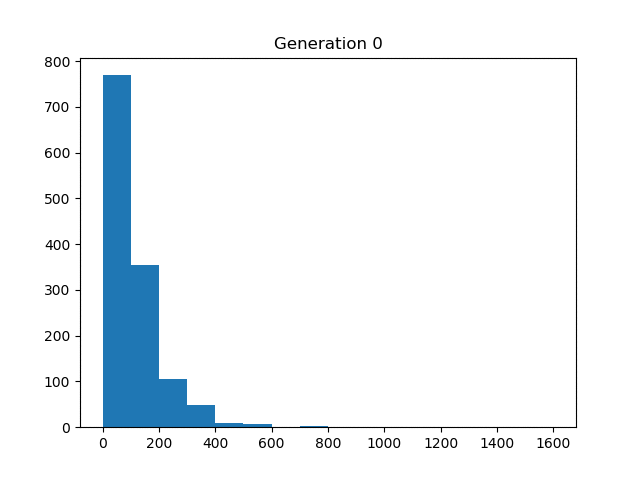

## Snake reinforcement learning.
This snake reinforcement learning performs the following steps:
1. Play ~500 games using the most recent neural network.
2. Take the best games from this generation and add them to the training dataset.
3. Remove the worst games from the training dataset.
4. Train a new neural network using the updated training dataset.

Below are the results of my ~3day training session.  

Top subplot shows the mean score of all games in that generations training set before any games are filtered out.  
Middle subplot shows the maximum score achieved in the training set. Scoring is +100 for food, -1 for move, +10000 for victory.  
Bottom subplot is number of games in the training set.  
  

The score histogram of each training generation.

A sample game using the neural network from different generations of training.